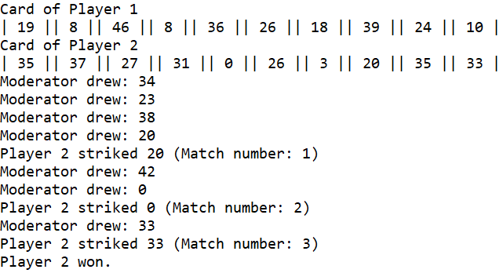

# MultiPlayerGame-Tambola
## The Game
There is one moderator and N players. Each player has a card containing 10 random numbers between 0-50. The moderator displays one number (between 0-50) at a time and the players strike that number off if they have it in their card. The winning criteria is that the player should have struck three numbers. The game ends when a winner has been found or the moderator has shown ten numbers. The player and moderator can have redundant numbers but the players can a strike a number off only once. The array of numbers can be accessed by only one person at a time.

## The Implementation
The game has been implemented using JAVA and it uses the Singleton Design Pattern, Observer Design Pattern and Multithreading.

## Execution
Run MultiPlayerGame.java to execute the code.

## Sample Output
 <!-- .element height="10%" width="10%" -->
